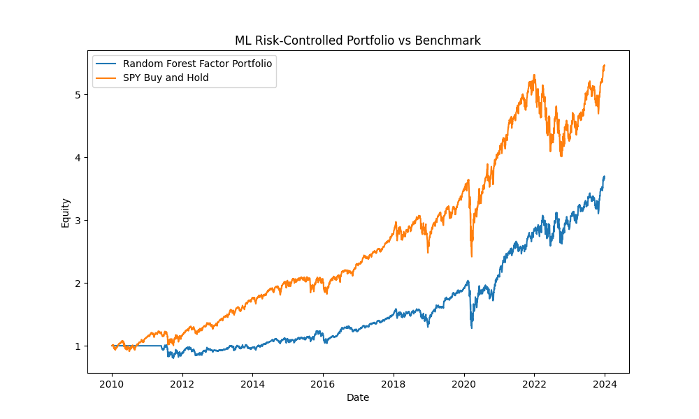
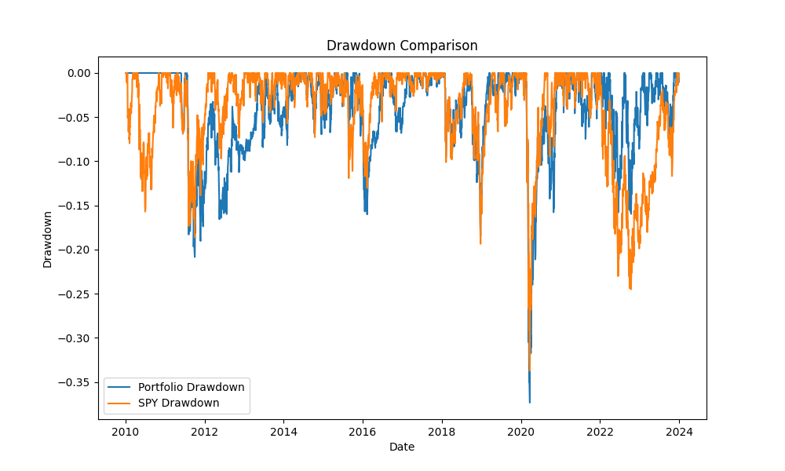
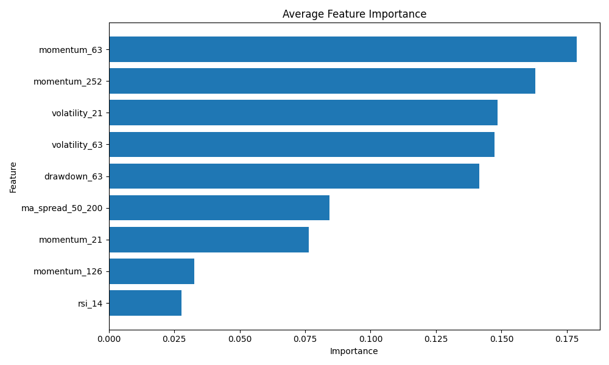

# professional-quant-factor-backtester
A modular Python framework for machine-learning-based cross-asset portfolio research, walk-forward backtesting, risk-controlled portfolio construction, transaction-cost modeling, and performance evaluation.

## Table of Contents

* [Project Overview](#project-overview)
* [Research Objective](#research-objective)
* [Key Features](#key-features)
* [Asset Universe](#asset-universe)
* [Factor Features](#factor-features)
* [Machine Learning Model](#machine-learning-model)
* [Walk-Forward Methodology](#walk-forward-methodology)
* [Portfolio Construction](#portfolio-construction)
* [Risk Management](#risk-management)
* [Transaction Cost Model](#transaction-cost-model)
* [Project Architecture](#project-architecture)
* [Installation](#installation)
* [How to Run](#how-to-run)
* [Testing](#testing)
* [Output Files](#output-files)
* [Performance Summary](#performance-summary)
* [Results](#results)
* [Interpretation](#interpretation)
* [Research Limitations](#research-limitations)
* [Possible Improvements](#possible-improvements)
* [Disclaimer](#disclaimer)

---

## Project Overview

This project implements an end-to-end quantitative research and portfolio backtesting framework in Python.

It combines:

* Historical market data collection
* Local price-data caching
* Multi-factor feature engineering
* Forward-return label construction
* Random Forest return prediction
* Walk-forward out-of-sample evaluation
* Cross-sectional asset ranking
* Inverse-volatility portfolio weighting
* Maximum position constraints
* Monthly portfolio rebalancing
* Transaction-cost modeling
* Benchmark comparison
* Performance and drawdown analysis
* Feature-importance analysis
* Automated unit testing

The project is designed to demonstrate both quantitative research methodology and software-engineering structure. Rather than placing the entire workflow in one script, individual responsibilities are separated into reusable modules.

---

## Research Objective

The research question is:

> Can a machine-learning model use historical price-based factors to identify ETFs with relatively stronger future 21-day returns?

At each monthly rebalance date, the framework:

1. Generates quantitative factors for every ETF
2. Trains a model using only previously available observations
3. Predicts each ETF's forward 21-day return
4. Ranks the ETFs by predicted return
5. Selects the top-ranked assets
6. Allocates capital using inverse-volatility weights
7. Applies position limits and transaction costs
8. Compares the resulting portfolio with SPY buy-and-hold

The project is intended as a research framework rather than evidence that machine learning necessarily produces market-beating returns.

---

## Key Features

### Quantitative research

* Cross-sectional ETF return prediction
* Multiple momentum and risk factors
* Forward 21-day return targets
* Monthly model retraining
* Walk-forward out-of-sample predictions
* Feature-importance tracking through time

### Portfolio construction

* Top-(N) asset selection
* Inverse-volatility allocation
* Maximum asset-weight constraint
* Lagged portfolio weights
* Turnover calculation
* Explicit transaction-cost deduction

### Performance analysis

* Total return
* Compound annual growth rate
* Annualized volatility
* Sharpe ratio
* Maximum drawdown
* Calmar ratio
* Positive-day ratio
* Average daily turnover
* Benchmark comparison

### Software engineering

* Modular package structure
* Type annotations
* Reusable functions
* Cached market data
* Configurable parameters
* Separate plotting module
* Unit tests with `pytest`
* Reproducible random state

---

## Asset Universe

The backtest uses a diversified ETF universe representing equities, fixed income, commodities, real estate, international markets, and sectors.

| Ticker | Exposure                         |
| ------ | -------------------------------- |
| SPY    | S&P 500 equities                 |
| QQQ    | Nasdaq-100 equities              |
| IWM    | U.S. small-cap equities          |
| TLT    | Long-term U.S. Treasury bonds    |
| GLD    | Gold                             |
| EFA    | Developed international equities |
| EEM    | Emerging-market equities         |
| VNQ    | U.S. real estate                 |
| XLE    | U.S. energy sector               |
| XLK    | U.S. technology sector           |

SPY is also used as the benchmark.

The configured backtest period is:

```text
2010-01-01 to 2024-01-01
```

---

## Factor Features

For every date and ETF, the framework calculates the following predictors.

### Momentum factors

* **21-day momentum**

```text
Price(t) / Price(t - 21) - 1
```

* **63-day momentum**

```text
Price(t) / Price(t - 63) - 1
```

* **126-day momentum**

```text
Price(t) / Price(t - 126) - 1
```

* **252-day momentum**

```text
Price(t) / Price(t - 252) - 1
```

These features represent short-, medium-, and long-horizon price trends.

### Volatility factors

* 21-day annualized volatility
* 63-day annualized volatility

Daily-return standard deviation is annualized using approximately 252 trading days.

### Drawdown factor

* 63-day rolling drawdown

This measures the current price relative to its highest value over the previous 63 trading days.

### Trend factor

* 50-day versus 200-day moving-average spread

```text
50-day moving average / 200-day moving average - 1
```

A positive value indicates that the shorter moving average is above the longer moving average.

### RSI factor

* 14-day Relative Strength Index

The RSI is scaled to a range between 0 and 1 before being passed to the model.

---

## Machine Learning Model

The project uses a:

```text
RandomForestRegressor
```

The model predicts each ETF's forward 21-day return.

### Model configuration

```text
Number of trees: 300
Maximum tree depth: 5
Minimum samples per leaf: 5
Random state: 42
```

The constrained tree depth and minimum leaf size are intended to reduce model complexity relative to an unrestricted Random Forest.

### Why Random Forest?

Random Forest is suitable for this project because it:

* Works well with tabular factor data
* Captures nonlinear relationships
* Captures interactions between factors
* Does not require feature standardization
* Is relatively robust to outliers
* Produces feature-importance estimates
* Can model relationships that a linear model may miss

However, Random Forest predictions are not automatically profitable. Financial data are noisy, non-stationary, and highly sensitive to the selected period and asset universe.

---

## Forward-Return Target

The prediction target is the future 21-trading-day return:

```text
Price(t + 21) / Price(t) - 1
```

This corresponds approximately to a one-month investment horizon.

Each model prediction represents the estimated forward return for one ETF at one rebalance date.

---

## Walk-Forward Methodology

The framework uses a walk-forward process rather than fitting one model to the entire dataset.

At each monthly rebalance date:

1. Factor features are calculated using information available up to that date
2. Training observations are restricted to historical data
3. A 21-day cutoff is applied so that training labels are already observable
4. The Random Forest model is retrained
5. The current ETF cross-section is passed to the model
6. Predicted forward returns are generated
7. ETFs are ranked by predicted return
8. The portfolio is rebalanced for the next holding period

This process is designed to reduce look-ahead bias.

The relevant training cutoff is conceptually:

```text
Training feature date + 21 trading days <= current prediction date
```

The model therefore does not intentionally train on a target whose realization occurs after the current rebalance date.

---

## Portfolio Construction

The portfolio-construction process is divided into two stages.

### Stage 1: Asset selection

At each rebalance date:

1. Predict the forward return of every ETF
2. Rank ETFs from highest to lowest predicted return
3. Select the top 3 ETFs

Configured value:

```text
TOP_N = 3
```

### Stage 2: Risk-based allocation

The selected ETFs are not automatically assigned equal weights.

Instead, the strategy calculates each selected asset's recent volatility and assigns inverse-volatility weights:

```text
Raw weight ∝ 1 / volatility
```

Assets with lower recent volatility receive relatively larger allocations, while more volatile assets receive smaller allocations.

The raw weights are normalized so that the portfolio sums to 100%.

---

## Risk Management

### Inverse-volatility weighting

The framework uses a 63-trading-day volatility lookback:

```text
VOL_LOOKBACK = 63
```

This helps prevent the portfolio from allocating the same amount to assets with materially different risk levels.

### Maximum position weight

Each asset is subject to a maximum portfolio weight:

```text
MAX_WEIGHT = 50%
```

After applying the cap, the remaining weights are renormalized.

### No look-ahead execution

Portfolio weights are shifted by one trading day when calculating returns:

```text
Return(t) uses Weight(t - 1)
```

This prevents the backtest from applying a weight to the same return used to determine that weight.

### Drawdown monitoring

The framework calculates the drawdown series for both:

* ML risk-controlled portfolio
* SPY benchmark

This makes it possible to compare not only final wealth but also the path and severity of losses.

---

## Transaction Cost Model

The strategy applies a proportional transaction cost based on portfolio turnover.

Configured transaction cost:

```text
TRANSACTION_COST = 0.001
```

This represents 0.10% per unit of portfolio turnover.

Turnover is calculated as:

```text
Sum of absolute changes in portfolio weights
```

Net portfolio return is calculated as:

```text
Net return = Gross return - Turnover × Transaction cost
```

Including transaction costs is important because frequent portfolio changes can make an apparently profitable signal unattractive after implementation costs.

The model does not currently distinguish between:

* Commissions
* Bid-ask spread
* Market impact
* Slippage
* Borrowing costs
* Tax effects

These are listed as areas for future development.

---

## Feature Importance

For every walk-forward model, the framework records Random Forest feature importance.

The average importance of each feature is plotted in:

```text
results/feature_importance.png
```

The raw time-series feature-importance observations are saved in:

```text
results/feature_importance.csv
```

Feature importance should be interpreted carefully. It measures how the fitted Random Forest uses each variable, but it does not prove that the feature has a stable causal relationship with future returns.

---

## Project Architecture

```text
professional-quant-factor-backtester/
├── README.md
├── requirements.txt
├── .gitignore
├── LICENSE
│
├── quant_research/
│   ├── __init__.py
│   ├── config.py
│   ├── data.py
│   ├── features.py
│   ├── labels.py
│   ├── model.py
│   ├── portfolio.py
│   ├── backtester.py
│   ├── metrics.py
│   ├── plots.py
│   └── run_backtest.py
│
├── data/
│   └── prices.csv
│
├── results/
│   ├── equity_curve.png
│   ├── drawdown.png
│   ├── feature_importance.png
│   ├── predictions.csv
│   ├── feature_importance.csv
│   ├── weights.csv
│   ├── backtest_results.csv
│   └── performance_report.csv
│
└── tests/
    ├── test_metrics.py
    └── test_portfolio.py
```

### Module responsibilities

| Module            | Responsibility                                     |
| ----------------- | -------------------------------------------------- |
| `config.py`       | Central configuration and research parameters      |
| `data.py`         | Data downloading, cleaning, caching, and loading   |
| `features.py`     | Factor construction and feature reshaping          |
| `labels.py`       | Forward-return target creation                     |
| `model.py`        | Model training, prediction, and feature importance |
| `portfolio.py`    | Asset selection, weighting, costs, and returns     |
| `backtester.py`   | Walk-forward research orchestration                |
| `metrics.py`      | Performance and risk statistics                    |
| `plots.py`        | Equity, drawdown, and importance charts            |
| `run_backtest.py` | Main executable entry point                        |
| `tests/`          | Unit tests for core calculations                   |

---

## Installation

### 1. Clone the repository

```bash
git clone https://github.com/szha0330-afk/professional-quant-factor-backtester.git
```

### 2. Enter the project directory

```bash
cd professional-quant-factor-backtester
```

### 3. Install dependencies

```bash
python -m pip install -r requirements.txt
```

The project uses:

* pandas
* numpy
* matplotlib
* yfinance
* scikit-learn
* pytest

---

## How to Run

Run the complete backtest from the repository root:

```bash
python -m quant_research.run_backtest
```

The program will:

1. Load cached prices when available
2. Download data when no cache exists
3. Generate factor features
4. Generate forward-return labels
5. Run the walk-forward training loop
6. Produce monthly predictions
7. Construct the risk-controlled portfolio
8. Apply turnover-based transaction costs
9. Calculate performance statistics
10. Save CSV outputs and charts

Example terminal output:

```text
Loading price data...
Running walk-forward ML factor backtest...
Saving result files...
Generating plots...

Backtest Completed
------------------
```

---

## Testing

Run the automated tests from the project root:

```bash
pytest
```

The current tests cover:

* Drawdown calculation
* Performance-metric generation
* Portfolio-return construction
* Equity-curve generation

Tests help verify that changes to the framework do not silently break core calculations.

---

## Output Files

### `predictions.csv`

Contains model predictions for each rebalance date and ticker.

Example columns:

```text
date
ticker
predicted_forward_return
```

### `feature_importance.csv`

Contains model feature importance for every walk-forward training date.

Example columns:

```text
date
feature
importance
```

### `weights.csv`

Contains daily portfolio weights after monthly rebalancing and forward filling.

### `backtest_results.csv`

Contains:

* Gross portfolio return
* Transaction cost
* Net portfolio return
* Turnover
* Portfolio equity curve
* Benchmark return
* Benchmark equity curve

### `performance_report.csv`

Contains the final performance comparison between the strategy and benchmark.

### Charts

The framework generates:

```text
results/equity_curve.png
results/drawdown.png
results/feature_importance.png
```

---

## Performance Summary

Backtest period:

```text
2010-01-01 to 2024-01-01
```

Benchmark:

```text
SPY Buy and Hold
```

| Metric                 | ML Risk-Controlled Portfolio | SPY Benchmark |
| ---------------------- | ---------------------------: | ------------: |
| Total Return           |                      266.36% |       445.52% |
| CAGR                   |                        9.73% |        12.90% |
| Annualized Volatility  |                       18.06% |        17.33% |
| Sharpe Ratio           |                         0.61 |          0.79 |
| Maximum Drawdown       |                      -37.34% |       -33.72% |
| Calmar Ratio           |                         0.26 |          0.38 |
| Positive Day Ratio     |                       48.81% |        55.03% |
| Average Daily Turnover |                        4.83% |           N/A |

---

## Results

### Equity Curve



### Drawdown Comparison



### Average Feature Importance



---

## Interpretation

The ML risk-controlled portfolio generated substantial positive returns over the test period, but it did not outperform the SPY benchmark.

The portfolio produced:

* Lower total return
* Lower CAGR
* Lower Sharpe ratio
* Lower Calmar ratio
* A deeper maximum drawdown
* Slightly higher annualized volatility
* A lower positive-day ratio

The strategy's average daily turnover was approximately 4.83%, which also created transaction-cost drag.

These findings are important because they demonstrate that:

> Greater model complexity does not automatically produce superior investment performance.

The Random Forest learned relationships between historical factors and forward returns, but those relationships were not strong or stable enough to outperform a simple equity benchmark over this sample.

The result is still valuable from a research perspective. A professional quantitative project should report unfavorable findings honestly rather than selectively changing parameters until the backtest appears successful.

---

## What the Results Suggest

Several explanations may contribute to the underperformance.

### Limited predictors

The model uses only price-derived technical factors. It does not include:

* Valuation data
* Earnings information
* Interest rates
* Inflation data
* Credit spreads
* Volatility indices
* Economic-surprise indicators
* Fund flows
* Positioning data
* Alternative data

### Small cross-sectional universe

The asset universe contains only ten ETFs. This provides relatively few observations at each prediction date and limits cross-sectional diversification.

### Benchmark concentration

SPY performed strongly over much of the selected period. A diversified cross-asset strategy may naturally lag a concentrated U.S. equity benchmark during a sustained equity bull market.

### Model instability

Feature-return relationships can change through time. Random Forest may fit historical nonlinear patterns that do not remain stable out of sample.

### Turnover drag

Monthly ranking changes generate turnover. Even relatively small per-trade costs accumulate over a long backtest.

### Risk model limitations

Inverse-volatility weighting controls relative position sizes but does not directly manage:

* Portfolio-level volatility
* Cross-asset correlation
* Tail dependence
* Regime shifts
* Maximum drawdown
* Factor concentration

---

## Research Limitations

This project is intended for educational and research demonstration. It is not a production trading system.

Important limitations include:

1. **Data-source limitations**
   The project relies on Yahoo Finance data, which may differ from institutional databases.

2. **Survivorship and selection bias**
   The ETF universe is selected using instruments known today.

3. **Simplified execution assumptions**
   The backtest does not model intraday execution, market impact, liquidity constraints, or partial fills.

4. **Simplified transaction costs**
   One constant proportional cost is applied to all instruments and periods.

5. **No hyperparameter validation framework**
   Model parameters are fixed rather than selected through nested time-series validation.

6. **No probability calibration or prediction intervals**
   The model produces point forecasts without confidence estimates.

7. **No explicit cash regime**
   The strategy always allocates to the top-ranked assets, even when all predicted returns are weak or negative.

8. **No portfolio-volatility target**
   Inverse-volatility weighting does not ensure that overall portfolio volatility remains constant.

9. **Limited model diversity**
   Only Random Forest is evaluated.

10. **No formal statistical significance test**
    The framework does not yet calculate bootstrap confidence intervals, White's Reality Check, or Deflated Sharpe Ratio.

---

## Possible Improvements

### Data and features

* Add macroeconomic variables
* Add yield-curve factors
* Add inflation and interest-rate indicators
* Add valuation measures
* Add volatility-index data
* Add correlation and beta factors
* Add cross-sectional factor ranks
* Add rolling factor z-scores
* Add regime-classification features

### Machine learning

* Compare linear regression and Elastic Net
* Compare Random Forest and Extra Trees
* Add Gradient Boosting
* Add XGBoost or LightGBM
* Add time-series-aware hyperparameter tuning
* Add expanding versus rolling training windows
* Add model ensembles
* Add prediction confidence filters
* Add SHAP-based model interpretation

### Portfolio construction

* Add volatility targeting
* Add cash allocation
* Add minimum predicted-return threshold
* Add covariance-aware optimization
* Add risk-parity allocation
* Add maximum sector and asset-class exposure
* Add turnover penalties
* Add weight smoothing
* Add position holding constraints

### Validation

* Add purged time-series cross-validation
* Add embargo periods
* Add rolling out-of-sample windows
* Add subperiod analysis
* Add market-regime analysis
* Add transaction-cost sensitivity testing
* Add parameter-stability testing
* Add bootstrap confidence intervals
* Add probabilistic Sharpe ratio
* Add Deflated Sharpe Ratio

### Engineering

* Add command-line arguments
* Add YAML configuration
* Add structured logging
* Add continuous integration with GitHub Actions
* Add static type checking
* Add code formatting and linting
* Add test coverage reporting
* Package the framework for installation
* Add experiment tracking

---

## Reproducibility

The Random Forest uses:

```text
RANDOM_STATE = 42
```

This helps ensure repeatable model fitting when the same:

* Python version
* Package versions
* Data
* Parameters
* Date range

are used.

For stronger reproducibility, future versions should pin dependency versions in `requirements.txt` or use a dedicated environment file.

---

## Key Takeaways

This project demonstrates a complete quantitative workflow rather than only presenting a final return chart.

The main lessons are:

* Walk-forward validation is essential for time-dependent financial data
* Training labels must be carefully aligned to avoid look-ahead bias
* Transaction costs can materially affect performance
* Portfolio construction is as important as prediction accuracy
* Inverse-volatility weighting does not guarantee lower portfolio drawdown
* Machine learning does not automatically create alpha
* Honest negative results are valuable in quantitative research
* Modular architecture makes research easier to test and extend

---

## Disclaimer

This repository is provided for educational and research purposes only.

It does not constitute:

* Investment advice
* Trading advice
* A recommendation to buy or sell securities
* A guarantee of future investment performance

Historical backtest results are hypothetical and do not represent actual trading. Real-world results may differ due to fees, slippage, liquidity constraints, market impact, taxes, data quality, and changing market conditions.
